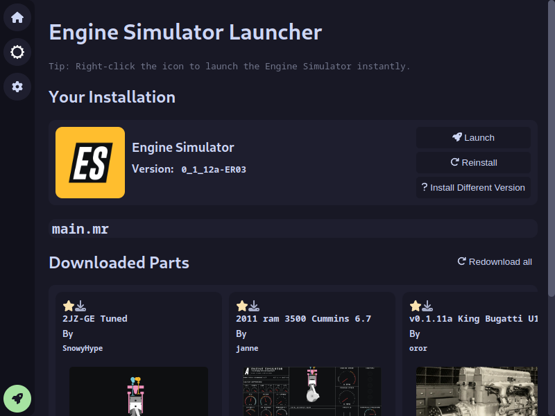

# Engine Simulator Manager
### *an easier way to manage your Engine Simulator*

# General Info

## What is this?
This is a manager for the [Engine Simulator](https://github.com/ange-yaghi/engine-simulator) by [AngeTheGreat](https://github.com/ange-yaghi).

## How does it work?
It fetches data from the [Parts Catalog](https://catalog.engine-sim.parts) and uses that data to set the `main.mr` file.

## How do I download it?
You can download the latest version from the [Releases page](https://github.com/DDev247/engine-sim-manager/releases).

# Technical details

## How does the program save/read files on my system?
The program uses a Node.js server to communicate between the front-end(what you see) and back-end(what you don't see). The client requests a specific URL (eg. `http://127.0.0.1:24704/status`) using `fetch()` in JavaScript and the server checks what the path is (in this case `/status`), and the search parameters (in this case nothing but it might be `?name=some_name`). After it processes everything it sends the return data to the client (in this case it would be the Node.js version, Electron version and some more).

# Developer Info

## How do I run it?
First install `node` using your package manager or from [Node's official site](https://nodejs.org)

### To start the React Development Server and Electron use

    npm run dev

### To build it (pack electron and build React) use

On Linux:

    sh ./pack.sh

On Windows:

    cmd ./pack.bat

After packing it go to the `bin` directory and choose the correct folder for you:

Linux:

    es-manager-linux-x64

Windows:

    es-manager-win32-x64

MacOS (requires signing):

    es-manager-mas-x64
